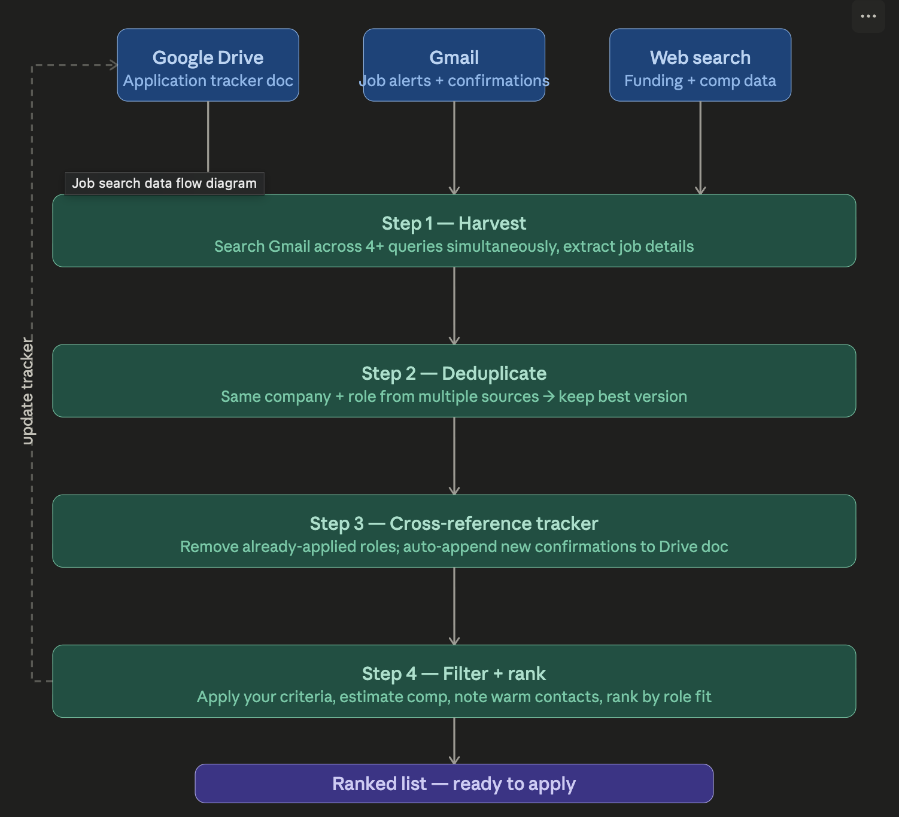

# Job Search Skill for Claude

A [Claude skill](jobsearch_skill.md) that automates the mechanical overhead of a job search. It searches Gmail across multiple alert sources simultaneously,
deduplicates results, cross-references an application tracker in Google Drive, filters by your criteria (role level, company stage, comp floor),
estimates compensation when it isn't posted, flags warm contacts, and outputs a ranked list of roles ready to act on.

Requires Gmail, Google Drive, and web search connected to Claude.

More detail on my [blog](https://waynehaber.com/2026/04/18/how-i-use-claude-to-automate-my-job-search/)

